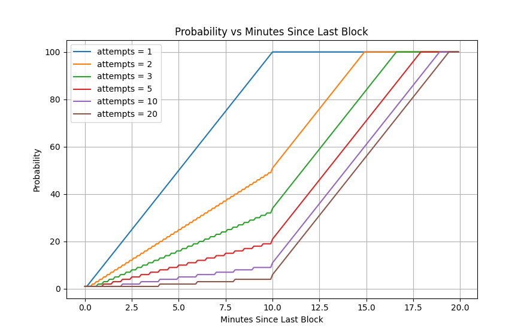

# Satoshi Tribute

## TL;DR
To mine $SATOSHI coins, send **0.06 TON** with the text **"F"** to the contract address `EQCkdx5PSWjj-Bt0X-DRCfNev6ra1NVv9qqcu-W2-SaToSHI`:
- Tonkeeper: [https://app.tonkeeper.com/transfer/EQCkdx5PSWjj-Bt0X-DRCfNev6ra1NVv9qqcu-W2-SaToSHI?amount=60000000&text=F](https://app.tonkeeper.com/transfer/EQCkdx5PSWjj-Bt0X-DRCfNev6ra1NVv9qqcu-W2-SaToSHI?amount=60000000&text=F)
- Another TON wallet: [ton://transfer/EQCkdx5PSWjj-Bt0X-DRCfNev6ra1NVv9qqcu-W2-SaToSHI?amount=60000000&text=F](ton://transfer/EQCkdx5PSWjj-Bt0X-DRCfNev6ra1NVv9qqcu-W2-SaToSHI?amount=60000000&text=F)

## Introduction
Satoshi Tribute is a token created to honor **Satoshi Nakamoto**, the founder of blockchain technology. This project expresses gratitude for the revolutionary ideas that changed the financial system and brings the crypto community together around decentralization and innovation.

## Mining
Mining Satoshi coins is simple and fair. Send **0.06 TON** to the contract address with the text **"F"** to initiate mining. The mining probability depends on the number of attempts and the time since the last block. The probability is described in the following chart:



- Probability **increases over time** and **decreases with the number of attempts**.
- No extra fees, pre-mining, or hidden mechanisms: **equal opportunities for all**.
- Every **210,000 blocks (~4 years)**, the mining reward is halved, just like Bitcoin.

## Smart Contract Transparency
- Built on **proven blockchain technology**.
- The mining probability algorithm is **fully open-source**.
- The code is available in the [Probability.tact](contracts/traits/Probability.tact) file for full transparency and security.

## Project Structure
- **`contracts`** - Source code of all smart contracts and dependencies.
- **`wrappers`** - Wrapper classes for contracts, implementing `Contract` from `ton-core`.
- **`tests`** - Test cases for the smart contracts.
- **`scripts`** - Deployment and automation scripts.
- **`utils`** - Utilities for scripts and UI.
- **`docs`** - Documentation.

## Smart Contract Usage
### Build
Run the following command to compile the contracts:
```
npx blueprint build
```

### Test
Run the tests with:
```
npx blueprint test
```

## Join the Community
Be part of an innovative and decentralized future, contribute to the history of cryptocurrencies and pay tribute to a legend. [Join our community](https://t.me/DAOthxS) on Telegram.
